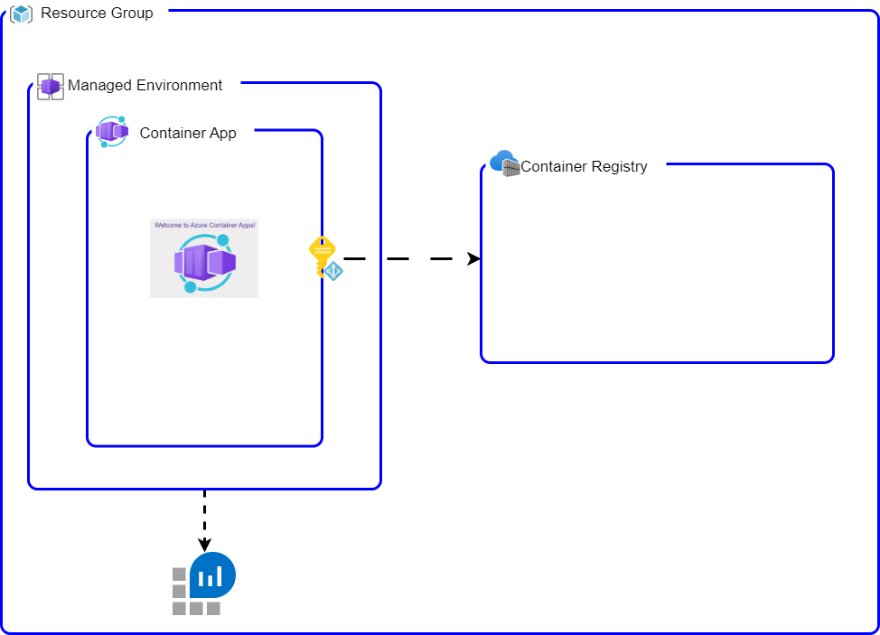

# Docusaurus-aca-azcli (Docusaurus in Azure Container App using azcli deployment)

This repository includes a simple Docusaurus Site with a basic template for hosting product documentation. The repository is a helper for exploring different `DevOps` options for Container Apps cse-devblog

This flow takes advantage of the `Azure CLI - containerapp update` command for updating the application after the bootstrap of the infrastructure. [link](https://learn.microsoft.com/en-us/cli/azure/containerapp?view=azure-cli-latest#az-containerapp-update)

## Bootstrap Infrastructure

Validate you are connected to an Azure subscription and update `infra/sample.main.parameters.json` to `infra/main.parameters.json` with your details.

```bash
make bootstrap
```

For this flow, the infrastructure bootstrapped looks like this:



## Deploy application

For the demo, we will be orchestrating the deployment locally. In other words, we will be running the pipeline commands locally. A sample pipeline is included in the ci folder.

1. Build the container

    After running the bootstrap, in this step we will be creating the docker container and pushing it into the bootstrapped ACR.

    ```bash
    make ci-package
    ```

2. use `az cli` to update the containerapp.

    ```make
    make deploy
    ```

## Continuous deployment

In this flow, the continuous deployment depends on the team updating the version of the image and simply exporting the new version as `RELEASE` before running the `make deploy`. In other words, the team only includes that step in their release pipeline.

```bash
export RELEASE=v1.0.0
make ci-package
make deploy
```

## Summary

This workflow distinctly delineates the responsibilities of the operations team, effectively mitigating the need for the development team to grapple with intricate configurations when deploying a new version of their application. More succinctly, the operations team can secure the infrastructure from inception, while developers are enabled to focus on their development tasks without having to comprehend the complexities of infrastructure configurations.

Nevertheless, one notable challenge with this workflow is that it necessitates the container application to be set in `single` mode for the revisions. Moreover, the initial state of the container application might manifest as `Degraded` state. This is primarily due to the potential discrepancy between the exposed port and the port used by the application that is being built and deployed.

### Pros

- Simplified Deployment: The development team is spared from having to understand and handle complex infrastructure configurations. This allows them to focus on their main task, which is developing the application.
- Clear Division of Responsibilities: The operations team and the development team have distinct roles, ensuring that each team can focus on their core competencies.
- Enhanced Security: With the operations team managing the infrastructure from the outset, there is likely to be better control and implementation of security measures.

### Cons

- bootstrap will look in a `Degraded` state because of the port misconfiguration.
- Containerapp `update` command doesn't allow the user to modify the port. Therefore the bootstrapped infrastructure can be pointing to the wrong port of the sample container image.
- Even though the `up` command allows the user to modify the target port, it requires all the configuration plus doesn't seem to have the option to setting the managed identity as the credentials to pull images from a private registry.
- Single Mode Constraint: The requirement for the container application to be in `single` mode for the revisions may limit the flexibility and functionality of the workflow.
- Port Discrepancy: The exposed port might differ from the port used by the application being built and deployed, potentially leading to communication issues or other conflicts within the application environment.
